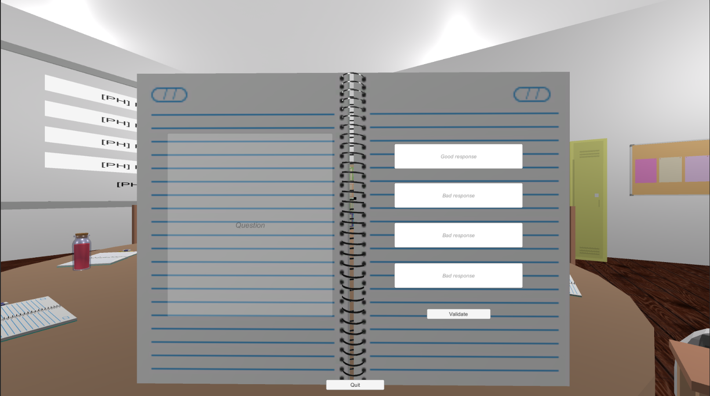
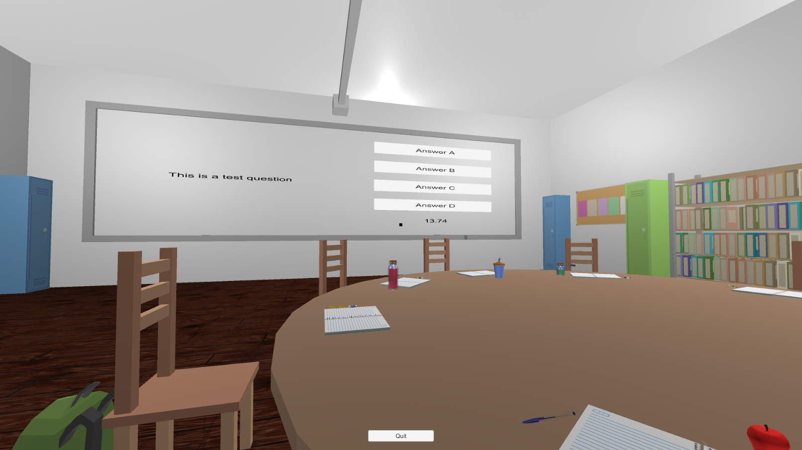

# Revision

Online serious game that helps with revisions.

## Context

Developped in a game development class during the COVID pandemic.

Developped with Unity in C# during 5 months.

Team : 
 - Miguel Mendes
 - Christophe Fracheboud

## Game

There is no goal expect learning stuff with friends. You'll find yourself in a classroom with the possibility to write down a question.

One of the player writes a question in his book (with 4 possible answers) and it is displayed on a whiteboard. Then each player can answer the question by selecting on of the answers within a defined time. At the end of the timer, if your answer is correct, it turns green. Otherwise, your answer turns red and the right turn green. You don't see what the others player answer.

You can find a video (trailer) of the game [here]() 